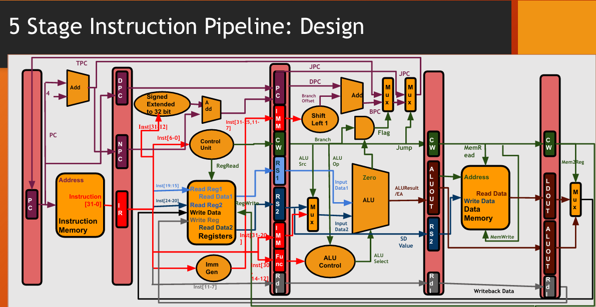

# RISC-V Assembler and Pipelined CPU Simulator

## Overview
This project is a C++ implementation of a two-pass assembler and a 5-stage pipelined CPU for a subset of the RISC-V 32I (RV32I) instruction set architecture. It's designed to take RISC-V assembly code, convert it into 32-bit machine code, and then simulate its execution on a pipelined processor model, including handling for data and control hazards.

## Files
  * [`Assembler.cpp`](Assembler.cpp): Contains only the Assembler module.
  * [`CPUDesign.cpp`](CPUDesign.cpp): Contains only the CPU module.
  * [`CPUWithAssembler.cpp`](CPUWithAssembler.cpp): Combines both the Assembler and CPU module into one file.

## Key Features
  * **Two-Pass Assembler**: Capable of parsing RISC-V assembly, resolving labels for branches and jumps, and generating corresponding machine code.
  * **5-Stage Pipelined CPU**: Simulates a classic 5-stage pipeline:
    1.  **IF**: Instruction Fetch
    2.  **ID**: Instruction Decode & Register Fetch
    3.  **EX**: Execute / Address Calculation
    4.  **MEM**: Memory Access
    5.  **WB**: Write Back
  * **Hazard Detection**: Implements basic detection and handling for:
      * **Data Hazards**: Stalls the pipeline when an instruction depends on the result of a previous, unfinished instruction (e.g., `lw` followed by `add` using the loaded register).
      * **Control Hazards**: Flushes the pipeline after a branch or jump instruction is taken to ensure the correct instruction sequence is fetched.
  * **Modular C++ Design**: Uses classes to represent key components like the `Assembler`, `Instruction`, `Register`, pipeline registers (`IFID`, `IDEX`, etc.), and control logic, making the code organized and extensible.
  * **Detailed Simulation Output**: Prints the state of general-purpose registers and data memory after each clock cycle, providing a clear view of the program's execution flow.

## Project Structure
The C++ code is organized into two main parts, all within a single file for simplicity.

### Assembler
The assembler is responsible for converting human-readable assembly instructions into 32-bit machine code.
  * **`Immediate` & `Register` Classes**: Helper classes to handle and convert immediate values and register names (e.g., `x5`) into their binary representations.
  * **`Instruction` Class**: A core class that contains methods to convert different instruction formats (R, I, S, B, U, J-Type) into their binary layout.
  * **`Assembler` Class**: The main assembler engine.
      * It uses a **two-pass approach**. The **first pass** scans the code to identify all labels (`loop:`, `done:`, etc.) and records their memory addresses.
      * The **second pass** translates each instruction into machine code. With the label addresses known, it can correctly calculate the offsets for branch and jump instructions.

### Pipelined CPU Simulator
The CPU simulator executes the generated machine code.
  * **Memory and Registers**:
      * `iMem`: A `vector<string>` to act as instruction memory.
      * `dMem`: An integer array to act as data memory.
      * `GPR`: An array of 32 integers for the general-purpose registers.
  * **Pipeline Registers**: Structs (`IFID`, `IDEX`, `EXMO`, `MOWB`) are used to hold the data and control signals that pass from one pipeline stage to the next.
  * **Control Unit**: A `map` (`ControlUnit`) defines the control signals (like `RegWrite`, `MemRead`, `ALUSrc`) for each instruction type based on its opcode.
  * **Pipeline Stages**: The `fetch()`, `decode()`, `execute()`, `memOperation()`, and `writeback()` functions simulate the behavior of each of the 5 pipeline stages.
  * **Hazard Unit**: Hazard detection logic is implemented within the pipeline functions to stall or flush the pipeline when necessary.

## Getting Started

### Prerequisites
You'll need a C++ compiler that supports the C++17 standard (for features like `std::tuple` and `std::bitset`). **g++** is recommended.

### Compilation

1.  Save the code as a `.cpp` file (e.g., `riscv_simulator.cpp`).
2.  Open your terminal or command prompt and compile the file using the following command:
    ```sh
    g++ -std=c++17 -o riscv_simulator riscv_simulator.cpp
    ```
3.  This will create an executable file named `riscv_simulator`.

### Execution

Run the simulator from the terminal:

```sh
./riscv_simulator
```

-----

## How to Use

### Inputting Assembly Code

To run your own assembly code, modify the `instructions` vector inside the `main()` function. The project includes two examples: **Sum of N Numbers** and **Fibonacci Sequence**. You can comment out one and uncomment the other to switch between them.

**Example (Fibonacci Sequence from the code):**

```
int main() {
    Assembler assembler;
    vector<string> instructions = {
        // Fibonacci Sequence
        "lw x1, 0(x0)",
        "beq x1, x0, done",
        "addi x3, x3, 1",
        "beq x1, x3, done",
        "addi x2, x0, 1",
        "addi x4, x4, 1",
        "for:",
        "beq x2, x1, done",
        "add x3, x4, x5",
        "add x5, x4, x0",
        "add x4, x3, x0",
        "addi x2, x2, 1",
        "jal x6, for",
        "done:",
        "sw x3, 1(x0)"
    };
    
    // ... rest of the main function
}
```

### Simulation Output

When you run the program, you will first see the machine code generated by the assembler. After that, the simulator will begin execution and print the state of the first 8 registers and key memory locations after each completed clock cycle.

**Example Output:**

```
Generated Machine Code:
00000000000000000000000010000011
...

Cycle 1 Complete.
 R[0]: 0 R[1]: 0 R[2]: 0 R[3]: 0 R[4]: 0 R[5]: 0 R[6]: 0 R[7]: 0
dMem[0]: 10, dMem[1]: 1

Cycle 2 Complete.
 R[0]: 0 R[1]: 10 R[2]: 0 R[3]: 0 R[4]: 0 R[5]: 0 R[6]: 0 R[7]: 0
dMem[0]: 10, dMem[1]: 1

...

Execution Complete.
R[0]: 0
R[1]: 10
R[2]: 10
R[3]: 55
...
```

## Supported Instructions

The assembler and simulator support the following subset of the RV32I instruction set:

| Type | Instruction | Description |
| :--- | :---------- | :---------------------------------- |
| **R-Type** | `ADD`, `SUB` | Add, Subtract |
| | `XOR`, `OR` | Bitwise XOR, OR |
| | `SLL`, `SRL`, `SRA` | Shift Left/Right Logical/Arithmetic |
| | `SLT`, `SLTU` | Set Less Than (Signed/Unsigned) |
| **I-Type** | `ADDI`, `XORI` | Add/XOR Immediate |
| | `ORI`, `ANDI` | OR/AND Immediate |
| | `SLTI`, `SLTIU` | Set Less Than Immediate (Signed/Unsigned) |
| | `JALR` | Jump and Link Register |
| **I-Shift**| `SLLI`, `SRLI`, `SRAI` | Shift Immediate |
| **L-Type** | `LB`, `LH`, `LW` | Load Byte/Halfword/Word |
| | `LBU`, `LHU` | Load Byte/Halfword Unsigned |
| **S-Type** | `SB`, `SH`, `SW` | Store Byte/Halfword/Word |
| **B-Type** | `BEQ`, `BNE` | Branch if Equal/Not Equal |
| | `BLT`, `BGE` | Branch if Less Than/Greater or Equal |
| | `BLTU`, `BGEU`| Branch (Unsigned) |
| **U-Type** | `LUI`, `AUIPC` | Load Upper Immediate, Add Upper Immediate to PC |
| **J-Type** | `JAL` | Jump and Link |

## A Schematic Illustration of 5-Stage Pipeline

